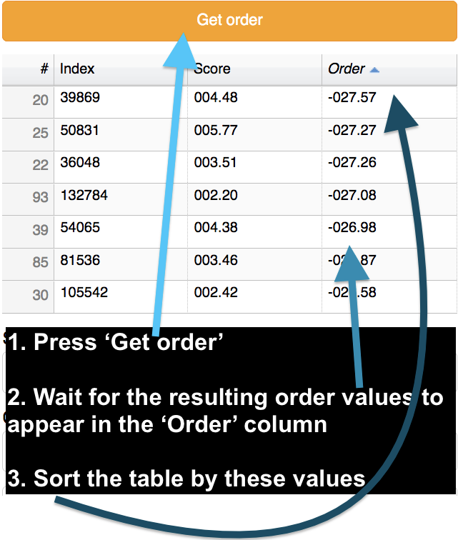
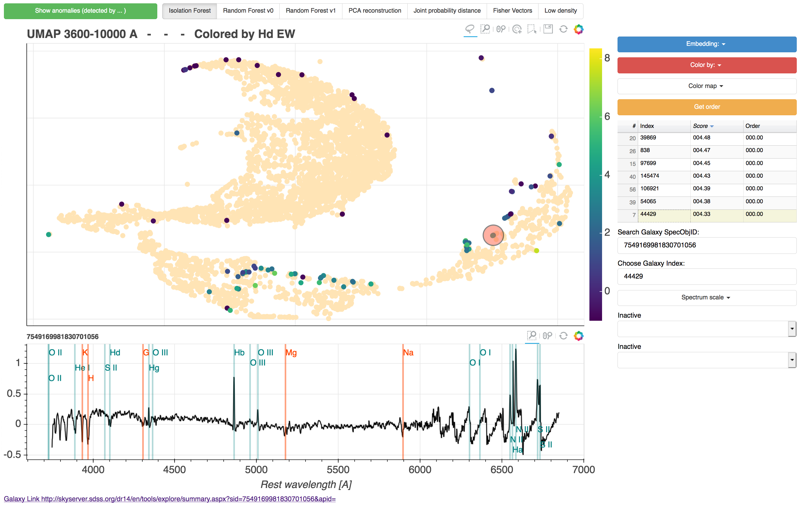
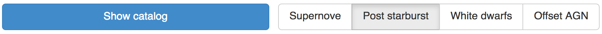

# *toast*

<div align="center">

</div>


[*toast*](http://138.197.206.129:5010/galaxies) ([Reis19](in prep)) is a data driven exploration tool of the Sloan Digital Sky Survey ([SDSS](https://www.sdss.org/)) galaxy spectra dataset. Currently it contains spectra of ~200,000 high SNR galaxies and quasars.


All these objects are presented on a single, interactive, 2D map of the data. Several such maps are available, on each map galaxies that share specific spectral properties are grouped together. By [interactively selecting](#objectSelection)  objects from the maps, the user can obtain and inspect groups of similar galaxies, examine the diversity of spectral features, and in general explore the data without relying on models. [*toast*](http://138.197.206.129:5010/galaxies) also includes the results of several [anomaly detection](#anomalyDetection) algorithms, making at least some of the most unusual galaxies readily available for inspection by the community.


## Interacting with the data
<a id="objectSelection"></a>
[*toast*](http://138.197.206.129:5010/galaxies) allows the user to view and select galaxies from a 2D embedding of the dataset. One of the supplied embedding is the familiar  Baldwin, Phillips & Telervich diagram ([BPT](http://adsabs.harvard.edu/abs/1981PASP...93....5B)). Using this embedding the user can select and view galaxies which have similar emission line ratios. Similarly, using the embeddings created by [UMAP](https://github.com/lmcinnes/umap), the user can select galaxies which have similar properties. In this case the similarity is an abstract similarity between the spectra of the galaxies. See the figure below for an example:


The selected galaxies are now listed in the right side of the screen and we can inspect their spectra. We can also sort the selected galaxies by the property according to which the galaxies are colored. This is shown in the figure below:


### other interaction buttons
In addition to the lasso selection tool, a few other interactive tools are available. The most relevant in our case are the [zoom in](#zoomInNote)  button, refresh, and save figure. These are shown in the figure below:


## Embedding the data

[*toast*](http://138.197.206.129:5010/galaxies) includes various embeddings of the data. These currently include the familiar BPT diagrams and a number of ([UMAP](https://github.com/lmcinnes/umap)) created 2 dimensional projections of the data. In the embeddings created using ([UMAP](https://github.com/lmcinnes/umap)) the axes do not have any physical significance. The basic interpretation of these embedding is simple: galaxies that are located near each other have similar spectra. While this notion should be enough to use the embedding for exploring the data, the details can sometimes provide additional insight. These details can be found in [Reis19](in prep).

We create different embeddings by considering different regions of the spectrum separately. We stress that this is done as for the case of galaxy spectra a single embedding will always discard important information. That is, there is no way to replace all the embeddings with a single better embedding. This is shown empirically by the fact that the galaxies cluster differently in the different embeddings. Such information cannot be enclosed in a single embedding, no mater how good it is. This is a  manifestation of the simple fact that two galaxy spectra can be similar in some ways and different in others. The relationship between two galaxy spectra thus can not be described by a single 'similarity' value. Any such single similarity value can be thought of as a weighted average over the similarities of the different features. For this king of applications, a good similarity measure is one that is sensitive to many different features, but no matter how good you choose the weights a weighted average will always be average and discard some of the information.   See  [Reis19](in prep) for additional discussion.

Selecting an embedding is done with the following button:


 Galaxies that are located  near each other on the ```UMAP 4700-5100 A``` embedding could be expected to have similar OIII, and Hb line properties, while    galaxies that are located  near each other on the ```UMAP 5680-6120 A``` embedding could be expected to have similar NaD line properties.

## Coloring the data

The galaxies can also colored by several different properties:


Most of these properties are taken from the [SDSS value added catalogs](https://www.sdss.org/dr14/data_access/value-added-catalogs/), the rest are calculated by us.

If you have suggestions for additional embeddings of color schemes, [let us know!](mailto:itamarreis@mail.tau.ac.il)


##  Ordering the data

The ```Get order``` button can optionally be used to order the selected objects before visually inspecting them. The ordering is based on the current embedding. Instead of going randomly from one selected object to another one might want to inspect objects with similar properties in groups. The ```Get order``` button effectively tries to find the shortest path to travel between the selected objects, on the embedding.
This can be useful for inspecting anomalies, as inspecting a group of anomalies with similar features can help us understand what are their unusual properties.



Note the sorting the table is only required for the purpose of viewing the objects one by one, according to the order (that is, it is not required for the stacking procedure described below). The result of the ordering could be visualized by coloring the embedding according to the order:


##  Stacking the data

With the ```Get stacks``` button we can look for trends in the data. ```Get stacks``` will bin the selected objects according to the order (which needs to by obtained as described above) and plot the stacked spectrum of each bin. Stacking the selected objects from the figure above we get:


For clarity, we show four zoom ins on different regions of the same plot. In this group of objects we see trends between the width of the emission lines, the Ha/NII line ratio, the EW of the sodium doublet, and the slope of the stellar continuum. Clearly much  work is needed to turn such observations to physical results, but this is an example of how [*toast*](http://138.197.206.129:5010/galaxies) could be used to generate seeds or ideas for finding correlations in the data.

The stacking could also be done according to the currently selected color and the coordinates of the embedding.

##  Detecting anomalies
 <a id="anomalyDetection"></a>

[*toast*](http://138.197.206.129:5010/galaxies) includes results of several anomaly detection algorithms. In scientific applications, anomaly detection is ultimately aimed at finding objects  we did not know existed and thus enabling new discoveries. To select the weirdest galaxies according to a given anomaly detection method, choose the method and press the ```Show anomalies``` button.


The example in the figure above will select the top 100 anomalies according to the Isolation Forest algorithm, show them on the current embedding, and list them on the right hand side. The result is shown in the figure below with the spectrum of one of the detected anomalies.



A comparison between the different methods and a discussion on the need of more than a single anomaly detection method can be found in [Reis19](in prep).


## Inspecting existing catalogs
[*toast*](http://138.197.206.129:5010/galaxies) includes a number of galaxy catalogs. To view a galaxy catalog, select it from the menu and click the ```Show catalog``` button. The menu is shown in the figure below:



This feature could be used in a number of ways. One example is looking for additional examples of the relevant galaxy type. If the selected galaxies are clustered on a given embedding, it is likely that additional examples could be found in the same cluster. Another use case example could be looking for subgroups according to the clustering of  galaxy included in the catalog on the different embeddings.

## Selecting your own galaxies
Selecting your own galaxies is available using the ```Search Galaxy SpecObjID:``` field, by entering a comma separated list of SDSS SpecObjIDs.


## Code and methods

The source code for [*toast*](http://138.197.206.129:5010/galaxies) is [publicly available](https://github.com/ireis/noitsnot), it is written in python using the [bokeh](https://bokeh.pydata.org/en/latest/) library.

The machine learning techniques used in [*toast*](http://138.197.206.129:5010/galaxies) include Uniform Manifold Approximation and Projection ([UMAP](https://github.com/lmcinnes/umap)) for dimensionality reduction, in addition to several anomaly detection methods: (i) Unsupervised Random Forest ([Shi06](https://horvath.genetics.ucla.edu/html/RFclustering/RFclustering/RandomForestHorvath.pdf), [Baron16](https://arxiv.org/abs/1611.07526), [Reis18](https://arxiv.org/abs/1711.00022)), (ii) Isolation Forest ([Liu08](https://scikit-learn.org/stable/modules/generated/sklearn.ensemble.IsolationForest.html#id1)), (iii) Fisher Vectors ([Rotman19](in prep)) (iv) PCA reconstruction ([Boroson10](https://ui.adsabs.harvard.edu/abs/2010AJ....140..390B/abstract)).   The code we used to produce all these results is publicly available. For Isolation Forest and PCA we used [scikit-learn](https://scikit-learn.org/stable/), and for Unsupervised Random Forest we used both [scikit-learn](https://scikit-learn.org/stable/) and [our own implementation](https://github.com/ireis/PRF). Our Fisher Vectors code relies on [VLFeat](http://www.vlfeat.org/). Something that makes a lot of sense and is certainly not a random hack was used for [ordering the galaxies](#orderSection) before inspection.

## Other notes

### <a id="zoomInNote"></a> Adaptive viewer

Interactive graphs can get very heavy with more than  a few thousands of objects. For this reason we implemented an adaptive viewer which shows a random subset of the objects with a fixed size. The user can see additional objects by zooming in on a specific region. An example is shown in the figure below:


