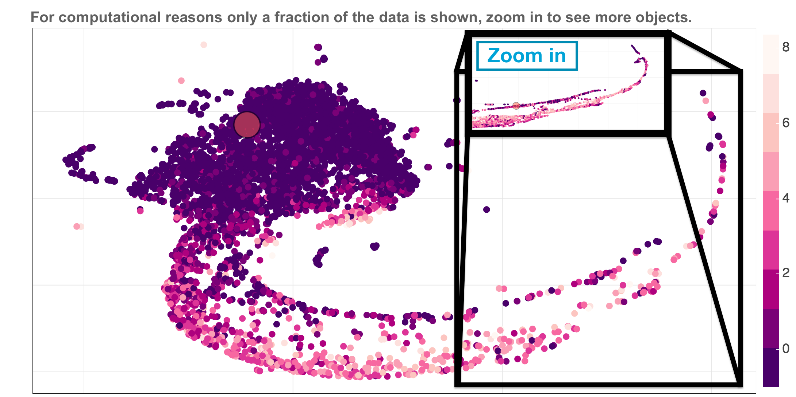

# toast

[toast](http://138.197.206.129:5010/galaxies) is a data driven exploration tool of the Sloan Digital Sky Survey [SDSS](https://www.sdss.org/) galaxy spectra dataset. Currently it contains spectra of ~200,000 high SNR galaxies and quasars.

The source code for [toast](http://138.197.206.129:5010/galaxies) is publicly available, it is written in python using the [bokeh](https://bokeh.pydata.org/en/latest/) library.

The machine learning techniques used in [toast](http://138.197.206.129:5010/galaxies) include Uniform Manifold Approximation and Projection [UMAP](https://github.com/lmcinnes/umap) for dimensionality reduction, anomaly detection by Unsupervised Random Forest ([Shi06](https://horvath.genetics.ucla.edu/html/RFclustering/RFclustering/RandomForestHorvath.pdf), [Baron16](https://arxiv.org/abs/1611.07526), [Reis18](https://arxiv.org/abs/1711.00022)), Isolation Forest [Liu08](https://scikit-learn.org/stable/modules/generated/sklearn.ensemble.IsolationForest.html#id1), and Fisher Vectors ... .

## Overview

[toast](http://138.197.206.129:5010/galaxies) allows the user to view and select galaxies on a 2D embedding of the dataset. One of the supplied embedding is the familiar diagram [BPT]() 

## Notes

Interactive graphs can get very heavy with more than  a few thousands of objects. For this reason we implemented an adaptive viewer which shows a random subset of the objects with a fixed size. The user can see additional objects by zooming in on a specific region. An example is shown in the Figure below:

## Features

## Commands

* `mkdocs new [dir-name]` - Create a new project.
* `mkdocs serve` - Start the live-reloading docs server.
* `mkdocs build` - Build the documentation site.
* `mkdocs help` - Print this help message.

## Project layout

    mkdocs.yml    # The configuration file.
    docs/
        index.md  # The documentation homepage.
        ...       # Other markdown pages, images and other files.
