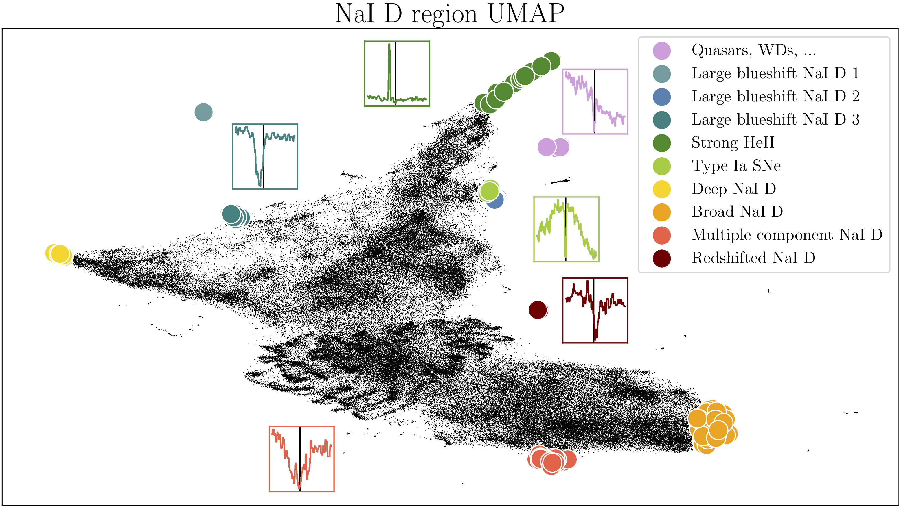

# *SDSS galaxies data exploration portal*

<div align="center">

</div>

In [Reis19](in prep) we introduced  a data driven exploration portal for the Sloan Digital Sky Survey ([SDSS](https://www.sdss.org/)) galaxy spectra dataset. It should be considered as an example for the approach discussed in that work for effectively using unsupervised ML in next generation astronomical surveys. The portal is [available here](http://138.197.206.129:5010/galaxies), this page provides instructions on how to use it.


The main feature of our such portal is thus  machine learned  two-dimensional embeddings (or maps) of the data, from which objects can be interactively selected and inspected. The interactive maps should be used with the simple notion that similar objects  are located close to each other.    Inspecting the maps with this notion, detecting potentially interesting phenomena is intuitive; objects that are isolated  on a map are interpreted as objects that are not similar to any other object in the dataset. Any structure in the ordering of objects suggests a continuous change in the properties of objects along the structure, and a compact group of objects implies the objects share some common properties. While the maps are built using ML their usage is intuitive and does not require any prior knowledge in this field.  


## Interactive similarity-based object selection
<a id="objectSelection"></a>
The portal allows the user to view and select galaxies from a 2D embedding of the dataset using a lass tool.   See the figure below for an example:


The selected galaxies are now listed in the right side of the screen and we can inspect their spectra.  This is shown in the figure below:


### other interaction buttons
In addition to the lasso selection tool, a few other interactive tools are available:  zoom in, refresh, and save. These are shown in the figure below:


## Different embeddings

The portal includes different embeddings of the data, each containing different information. The embeddings are created using  [UMAP](https://github.com/lmcinnes/umap), where different embeddings are constructed with different wavelength regions of the spectrum. The familiar BPT diagrams are included as well. Selecting an embedding is done with the following button:


 Galaxies that are located  near each other on the ```UMAP 4700-5100 A``` embedding could be expected to have similar OIII, and Hb line properties, while    galaxies that are located  near each other on the ```UMAP 5680-6120 A``` embedding could be expected to have similar NaD I line properties.

## Coloring the data

The maps can be colored by several different properties:


Most of these properties are taken from the [SDSS value added catalogs](https://www.sdss.org/dr14/data_access/value-added-catalogs/), the rest are calculated by us.


##  Detecting anomalies
 <a id="anomalyDetection"></a>

Anomalies can be detected directly form the map, as objects that are isolated, lie in small clusters, or found in extreme ends of the 2D distribution of objects. For example, objects with unusual NaD I properties are shown on the relevant [UMAP](https://github.com/lmcinnes/umap) in the figure below.



In addition,  the portal includes results of several anomaly detection algorithms. In scientific applications, anomaly detection is ultimately aimed at finding objects  we did not know existed and thus enabling new discoveries. To select the weirdest galaxies according to a given anomaly detection method, choose the method and press the ```Show anomalies``` button. This will select the top anomalies according to the selected algorithm, show them on the current embedding, and list them on the right hand side. The result is shown in the figure below with the spectrum of one of the detected anomalies.


## Stacking spectra on the fly

The user of our portal can select a specific region on the map and a specific direction, and stack the galaxies in bins along the chosen direction. This can be done with the  ```Get stacks``` button (after selecting objects with the lasso tool). The number of stacks can be specified with the  ```Number of stacks``` menu. The objects are binned according the the x or y coordinates, or automatically, as specified in the ```Stack by``` menu. The automatic option will try to detect a 1 dimensional structure on the map, and bin the objects according to it. The stacks are shown in the buttom panel, (below the individual spectrum panel).


After using the  ```Get stacks``` button it is possible to color the map by  the property the used to bin the objects. This can be done by selecting  ```Order``` from the ```Color by``` menu.


## Selecting your own galaxies
Selecting your own galaxies is available using the ```Search Galaxy SpecObjID:``` field, by entering a comma separated list of SDSS SpecObjIDs.


## Code and methods

The source code for portal is [publicly available](https://github.com/ireis/potral), it is written in python using the [bokeh](https://bokeh.pydata.org/en/latest/) library.

The machine learning methods used  include Uniform Manifold Approximation and Projection ([UMAP](https://github.com/lmcinnes/umap)) for dimensionality reduction, in addition to several anomaly detection methods: (i) Unsupervised Random Forest ([Shi06](https://horvath.genetics.ucla.edu/html/RFclustering/RFclustering/RandomForestHorvath.pdf), [Baron16](https://arxiv.org/abs/1611.07526), [Reis18](https://arxiv.org/abs/1711.00022)), (ii) Isolation Forest ([Liu08](https://scikit-learn.org/stable/modules/generated/sklearn.ensemble.IsolationForest.html#id1)), (iii) Fisher Vectors ([Rotman19](http://www.insticc.org/node/TechnicalProgram/ic3k/presentationDetails/81633)) (iv) PCA reconstruction ([Boroson10](https://ui.adsabs.harvard.edu/abs/2010AJ....140..390B/abstract)).   The code we used to produce all these results is publicly available. For Isolation Forest and PCA we used [scikit-learn](https://scikit-learn.org/stable/), and for Unsupervised Random Forest we used both [scikit-learn](https://scikit-learn.org/stable/) and [our own implementation](https://github.com/ireis/PRF). Our Fisher Vectors code relies on [VLFeat](http://www.vlfeat.org/). Something that makes a lot of sense and is certainly not a random hack was used for [ordering the galaxies](#orderSection) before inspection.

## Other notes

### <a id="zoomInNote"></a> Adaptive viewer

Interactive graphs can get very heavy with more than  a few thousands of objects. For this reason we implemented an adaptive viewer which shows a random subset of the objects with a fixed size. The user can see additional objects by zooming in on a specific region. An example is shown in the figure below:


